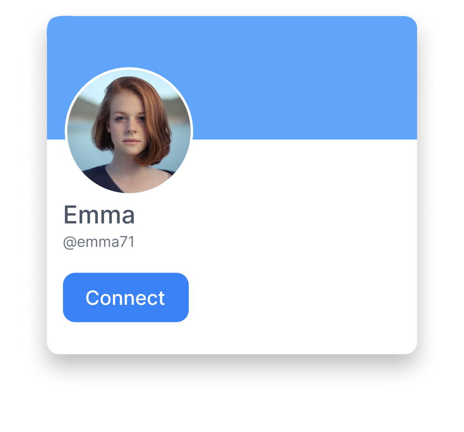
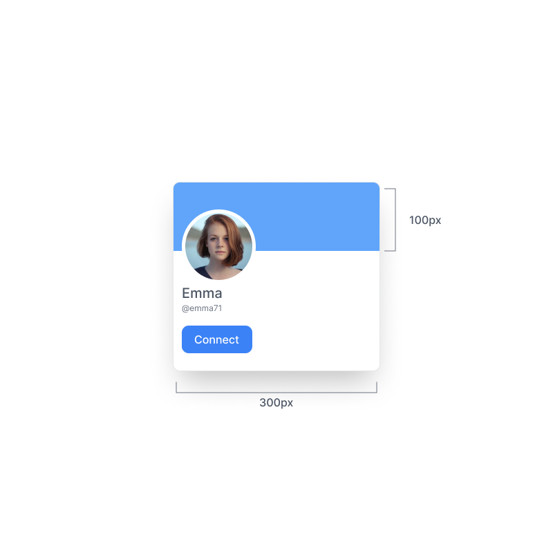
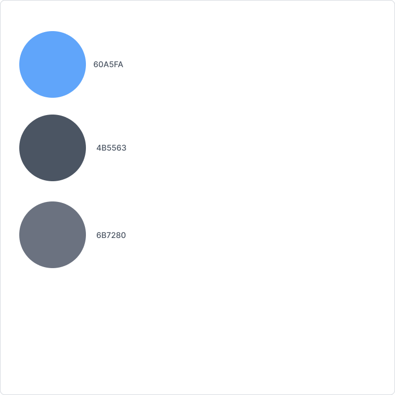

# User Card Exercise
---------------

`#Easy` `#HTML` `#CSS` 

## Description 
In this exercise, you'll be creating a user profile card using HTML and CSS.

Your job is to get as close to the design as possible.

 
 

#### Skills You'll Improve
- HTML
- CSS

 
 
 

#### Measurements

#### Colors

### Images

Profile Image (copy the url)

Image URL = https://raw.githubusercontent.com/Chimppen/web-ninja-exercises/master/easy/User-card/profile-picture.png

 
 
 
 
 
 

Have fun!